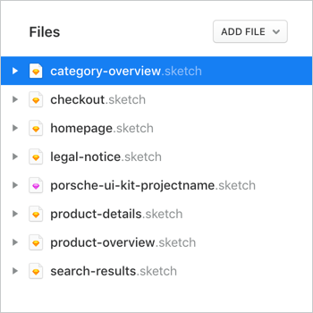
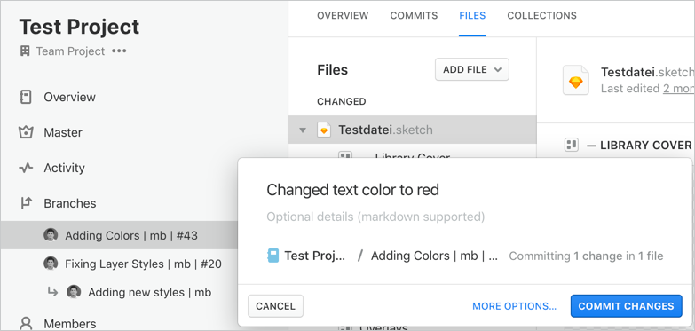

# Design Workflow

<TableOfContents></TableOfContents>

## General information 
We encourage an open and clear design workflow overall digital Porsche products with shared tools and workflows. Using the Abstract tool enables automated file management and version control - without the risk of losing data. The overall accessibility of files also brings different roles and teams closer together and enables a fast collaboration.

[Read more about Abstract](https://www.goabstract.com/how-it-works/) or watch some [Abstract videos](https://vimeo.com/goabstract).

### Project and file structure
The Porsche organisation is structured by the context within different sections. Product-specific files are stored in different team projects. Team projects are visible for all organisation members by default. Confidential work is stored in private projects, which are only accessible by members on invitation.

For better discoverability, files and libraries within a project are recommended to be split and named by their features in lower case with hyphenation. All libraries created within the Porsche organisation should be named with the format `porsche-design-system-[projectname].sketch`.

### User roles and rights
User roles define whether a user can just view or actually work on the stored files. Contributor seats for designers have to be paid and therefore requested [here](http://eepurl.com/gnOIXD).
- **Contributors, usually designers,** have access to all features including creating, editing and updating files.
- **Viewers, usually stakeholders and developers,** are only able to view and comment on shared files.

Both roles can be granted different rights. 
- **Members** of the organisation have access to all public projects and can be invited individually to private projects.
- **Guests** have to be invited individually for each project to gain access.

### Add members to your private project or invite guests
1. Login to Abstract
2. Navigate to your project and click on "Members" on the left-hand navigation bar
3. Click on "..." on the right side of a member item to manage their role or remove them from the project
4. Select "Invite People" to add new team members or invite guests

## Design workflow
Changes within files are made by using the Abstract desktop app and Sketch. Within a project, the master branch represents all approved work as the latest version of the project. Tasks that are currently under development are nested in different branches and child branches. To release a finalised task, the specific branch must be merged into the master.

### 1. Start working on a change
We open branches for any file change we're doing to avoid having to update the master too frequently. If you would like to pick up where someone else left off in a branch, you can open a child branch.

1. **Create a branch** either from the master or from an existing branch by clicking "New branch..." or by opening a file with "Edit in Sketch". Sketch files can also be opened untracked to test something without saving.
2. **Name the branch** including the main topic, effort type or the issue number and your signature letters,  
e.g. `pagination accessibility recoloring | mb | #44`. For more context, you can also add a description and a status to the branch.
4. **Save changes in Sketch and sync them** regularly as commits to Abstract by clicking on "Commit changes" at the bottom. 
5. **Describe the committed changes** to make them visible for others, e.g. `Changed text color from blue to red`. Commit often and describe what you did. Adding detail of what you accomplished in each commit is useful for you and for your coworkers.

### 2. Review and merge changes
When you think you’re done with your branch, you should always add stakeholders or coworkers as reviewers to get feedback on your work before you merge it to the master branch.

1. Select your branch that you would like to be reviewed
2. Click "Request Review" in the top right and type the team members whom you would like to review your changes

Updating from the master every few weeks is effective for keeping your branch up to date and avoiding a huge workload when you’re finally ready to merge. Once your review has been approved, you’re ready to merge.

1. Select the branch that you would like to merge into the master or a child branch you would like to merge into the parent branch.
2. Click "Merge branch" at the top right and log a short but descriptive change in the notes.
3. Click the button "Merge and archive".
4. When your local version of the master branch is not up-to-date (often a result of being offline), you get a diverged copy. Be sure to resolve this immediately.
5. Inform the team about your merging.

### 3. Engineering and stakeholder "handoff"
Collections are very useful in focusing the attention of your fellow designers and stakeholders on the screens you’re modifying. You can arrange them according to the story you’re trying to tell and to give additional context within them.
