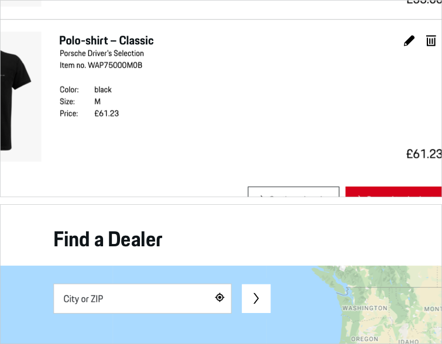
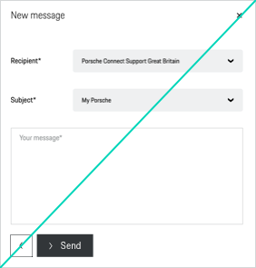

# Button Icon

A Button Icon is an icon-only squared button that enables the user to execute an action or jump to another page with a single tap. Since it only contains an icon and no further text information, it is highly recommended to use it only in cases where the user is fully aware of the button function (this can be ensured e.g. by using an expressive icon or by logical composition with other components - just think of a form field followed by a Button Icon with submit function).

---

## Button types

In order to provide an optimal user guidance within a page, different hierarchy types of the Button Icon are available:

### 1. Basic

<p-button-icon></p-button-icon>

Default Button Icon with monochrome color fill.

### 2. Ghost

<p-button-icon variant="ghost"></p-button-icon>

An "outline only" Button Icon version. It is always to be used stand-alone and never in combination with a filled Button Icon or other button types. In the hierarchy the ghost button is always subordinated to color filled button actions within the same page.

### 3. Icon

<p-button-icon variant="transparent"></p-button-icon>

Icon only without background.

---

## Button states

All button types are available in the following states:

| STATE | DESCRIPTION |
|----|----|----|
| default | Default button state. |
| active / hover | In active or hover state, the background color changes slightly and gets either a bit lighter or darker. |
| disabled | Whenever the button function is not available, it is indicated by a greyed-out button color. |
| loading | To indicate the loading process when clicking on the text link, the icon is replaced by a small loading spinner. |
| focus | In focus state, the button is bordered by a 2 px line in focus color and with a distance of 1 px to the component. |

---

## Content

The Button Icon is available for both Porsche Light and Dark Theme. It contains only an **icon** that can be replaced by any icon available in the Porsche web icon set. Per default, an arrow right is set to serve in most of all cases. It should only be changed if it is ensured that another symbol is more appropriate to support the text content, making it easier for users to understand the function quickly. E.g. use a shopping icon for "Add to cart" button. 

---

## Usability & interaction

### Clickability

The whole button area is clickable. The clickability is indicated by a specific hover state (slightly changing color).

### Disabled state

All types of Button Icon are provided in disabled state. Whenever possible, disabled states should be avoided. They tend to disrupt the user and break the user flow. Keep in mind: “The best way [to] prevent user error is to make sure that the use cannot make errors in the first place (…).” (Donald A. Norman, 2002).

<p-headline variant="headline-3" tag="h3">Examples</p-headline>

## Don'ts
