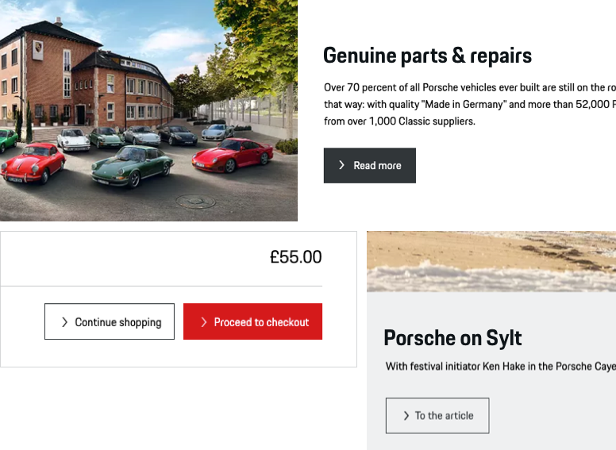
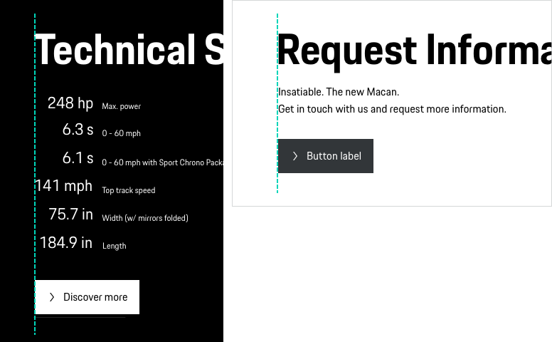

# Button Regular

A Button enables the user to execute an action, change the state of an application or jump to another page with a single tap. For an optimal user guidance and dedicated pursuit of business or sales goals, different types of buttons (basic, highlight, ghost) can be used.

---

## Available sizes

The Button is provided in 2 different sizes:

- **Button Regular**
Default button size with 50 px height. The button length adapts to the length of the text label.
- **Button Small**
A Button Small is a slightly smaller version of the Button Regular (32 px height) and should be used only in special cases, when a standard size is not appropriate, for example when there is a lack of space and/or it must be ensured that the button is visible above the fold.

---

## Button types

In order to provide an optimal user guidance within a page, different hierarchy types of buttons are available:

### 1. Highlight

<p-button-regular variant="highlight">Click Here!</p-button-regular>

Button with color fill in Porsche Red. This type is only to be used for one or two high-priority actions within the page, in order to give the user the best guidance possible.  

### 2. Basic

<p-button-regular>Click Here!</p-button-regular>

Default button with monochrome color fill. To be used for all other stand-alone buttons that aren't high priority.

### 3. Ghost

<p-button-regular variant="ghost">Click Here!</p-button-regular>

An "outline only" button version. In hierarchy the ghost button is always subordinated to the filled view. Thus, it can be used in two different cases:

- In combination with a filled button (Highlight or Basic), for example in popular pairings such as "submit" (filled) and "cancel" (ghost).
- Stand-alone, when the priority of the action is lower compared to all other button actions within this page.

---

## Button states

All button types are available in the following states:

| STATE | DESCRIPTION |
|----|----|----|
| default | Default button state. |
| active / hover | In active or hover state, the background color changes slightly and gets either a bit lighter or darker. |
| disabled | Whenever the button function is not available, it is indicated by a greyed-out button color. |
| loading | Indicates the loading process when clicking on the text link, the icon is replaced by a small loading spinner. |
| focus | In focus state, the button is bordered by a 2 px line in focus color. |

---

## Content

The Button Regular is available for both Porsche Light and Dark Theme. It always contains the following sub-components:

- **Icon**
The icon can be replaced by any icon available in the Porsche web icon set. By default, an arrow right is set that should serve in most of all cases. It should be changed only if it is ensured that another symbol is more appropriate to support the text content, making it easier for the user to understand the function quickly. A good example might be to use a shopping icon or a plus icon for a Button "Add to cart".
- **Text label**
The text label is always set in copytext size. The length of the text label determines the size of the button. Multiline text is possible, while the content (both text and icon) are always positioned top left aligned within the button.
It is recommended to keep the text label short and descriptive.

---

## Button position

By default the Button Regular is to be positioned left-aligned within a module or a screen. Depending on content and user guidance, the position can be changed individually, e.g. placed right-aligned or at the end of a text (e.g. error notifications)

---

## Usability & interaction

### Clickability

The whole button area is clickable. The clickability is indicated by a specific hover state (slightly changing color).

### Button width

Even if there is no technical limit to the button width, you should always make sure that the button remains legible, even more so in multiline state. It is recommended to use max. 100 characters per line (equals approx. 700 px button width).

### Disabled state

All types of Button Regular and Small are available as disabled state. However, disabled states should be avoided whenever possible, as they always tend to disrupt the user and break the user flow. Keep in mind: “The best way [to] prevent user error is to make sure that the use cannot make errors in the first place (…).” (Donald A. Norman, 2002)

<p-headline variant="headline-3" tag="h3">Best Practices</p-headline>

<p-text variant="small">(1) Button Regular with monochrome color fill. Usage is not a high priority.</p-text>
<p-text variant="small">(2) The Ghost Button is (in combination with the highlight) subordinated to the filled view.</p-text>
<p-text variant="small">(3) Stand-alone Ghost Button.</p-text>

(1) and (2) Example of the default left-aligned position of the Button Regular.