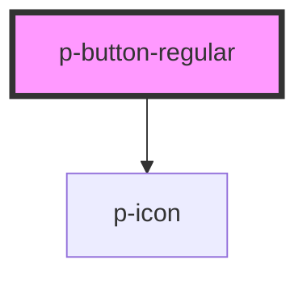

# p-button-regular

<!-- Auto Generated Below -->

## Properties

| Property   | Attribute  | Description                                                                              | Type                              | Default                           |
| ---------- | ---------- | ---------------------------------------------------------------------------------------- | --------------------------------- | --------------------------------- |
| `disabled` | `disabled` | Some optional disabled state                                                             | `boolean`                         | `false`                           |
| `icon`     | `icon`     | The icon of the button.                                                                  | `string`                          | `"icon_arrow-right-hair.min.svg"` |
| `inverted` | `inverted` | Button on dark background                                                                | `boolean`                         | `false`                           |
| `label`    | `label`    | Label                                                                                    | `string`                          | `''`                              |
| `loading`  | `loading`  | Disables the button and shows a loading indicator. No onClicked event will be triggered. | `boolean`                         | `false`                           |
| `ref`      | `ref`      | React test property                                                                      | `any`                             | `''`                              |
| `role`     | `role`     | Specifies the HTML Type of the button. If undefined, nothing is set.                     | `"button" \| "reset" \| "submit"` | `undefined`                       |
| `small`    | `small`    | A button can be displayed with a smaller size                                            | `boolean`                         | `false`                           |
| `tag`      | `tag`      | HTML tag                                                                                 | `string`                          | `"button"`                        |
| `type`     | `type`     | The display type of the button.                                                          | `"ghost" \| "highlight"`          | `undefined`                       |

## Events

| Event       | Description                  | Type               |
| ----------- | ---------------------------- | ------------------ |
| `onClicked` | Called after a user's click. | `CustomEvent<any>` |

## Dependencies

### Depends on

- [p-icon](../../base/icon)

### Graph

----------------------------------------------

*Built with [StencilJS](https://stenciljs.com/)*
