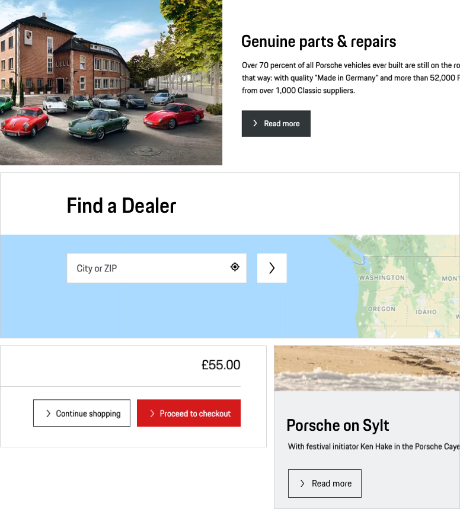

# Button

A Button enables the user to execute an action or change the state of an application within the page. For an optimal user guidance and dedicated pursuit of business or sales goals, different types of buttons (primary, secondary, tertiary) can be used.

---

## Available variants

The Button is provided in 2 different variants:

- **Icon and Text** Default button size with 48 px height. The button length adapts to the length of the text label.
- **Icon only** The icon only contains an icon and no further text information, it is highly recommended to use it only in cases where the user is fully aware of the button function (this can be ensured e.g. by using an expressive icon or by logical composition with other components - just think of a form field followed by a Button Icon with submit function)

## Button types

### **1. P**rimary

<p-button variant="primary">Some label</p-button> 

Button with color fill in Porsche Red. This type is only to be used for one or two high-priority actions within the page, in order to give the user the best guidance possible.

### **2. S**econdary

<p-button>Some label</p-button>

Default button with monochrome color fill. To be used for all other stand-alone buttons that aren't high priority.

### **3. T**ertiary

<p-button variant="tertiary">Some label</p-button>

An "outline only" button version. In hierarchy the tertiary button is always subordinated to the filled view. Thus, it can be used in two different cases:

- In combination with a filled button (Primary or Secondary), for example in popular pairings such as "submit" (filled) and "cancel" (Tertiary).
- Stand-alone, when the priority of the action is lower compared to all other button actions within this page.

---

## Button states

All button types are available in the following states:

| STATE | DESCRIPTION |
|----|----|----|
| default | Default button state. |
| active / hover | In active or hover state, the background color changes slightly and gets either a bit lighter or darker. |
| disabled | Whenever the button function is not available, it is indicated by a greyed-out button color. |
| loading | To indicate the loading process when clicking on the text link, the icon is replaced by a small loading spinner. |
| focus | In focus state, the button is framed by a 2 px line in focus color. |

---

## Content

The Button is available for both Porsche Light and Dark Theme. It always contains the following sub-components:

### **Icon**
By default, an arrow right is set that should serve in most of all cases. It should be changed only if it is ensured that another symbol is more appropriate to support the text content, making it easier for the user to understand the function quickly. In addition, it should be ensured that the icon only variant is used for internationally known icons.

To ensure the alignment in all Porsche web appliccations we recommend to use dedicated, standardized icons for the following cases:

| INTERACTION | ICON | ADDITIONAL INFO | 
|----|----|----|
| Close/Cancel | <p-icon name="close" aria-label="Close icon"></p-icon> | Use a close icon for conclude content like modals and alerts (usally as an icon only) and a cancel icon for abandoning the process. | 
| Delete | <p-icon name="delete" aria-label="Delete icon"></p-icon> |  |
| Edit | <p-icon name="edit" aria-label="Edit icon"></p-icon> |  |
| Add | <p-icon name="plus" aria-label="Plusicon"></p-icon> |  |

### **Text label**
The text label is always set in copytext size. The length of the text label determines the size of the button. Multiline text is possible, while the content (both text and icon) are always positioned top left aligned within the button. It is recommended to keep the text label short and descriptive.

---

## Button position

By default the Button is to be positioned left-aligned within a module or a screen. Depending on content and user guidance, the position can be changed individually, e.g. placed right-aligned or at the end of a text (e.g. error notifications)

---

## Usability & interaction

### Clickability

The whole button area is clickable. The clickability is indicated by a specific hover state (slightly changing color).

### Button width

Even if there is no technical limit to the button width, you should always make sure that the button remains legible, even more so in multiline state. It is recommended to use max. 100 characters per line (equals approx. 700 px button width).

### Disabled state

All types of Button are available as disabled state. However, disabled states should be avoided whenever possible, as they always tend to disrupt the user and break the user flow. Keep in mind: “The best way [to] prevent user error is to make sure that the use cannot make errors in the first place (…).” (Donald A. Norman, 2002)

    <p-headline variant="headline-3" tag="h3" style="margin-bottom: 24px;">Examples</p-headline>
    

---

## Don'ts
  
