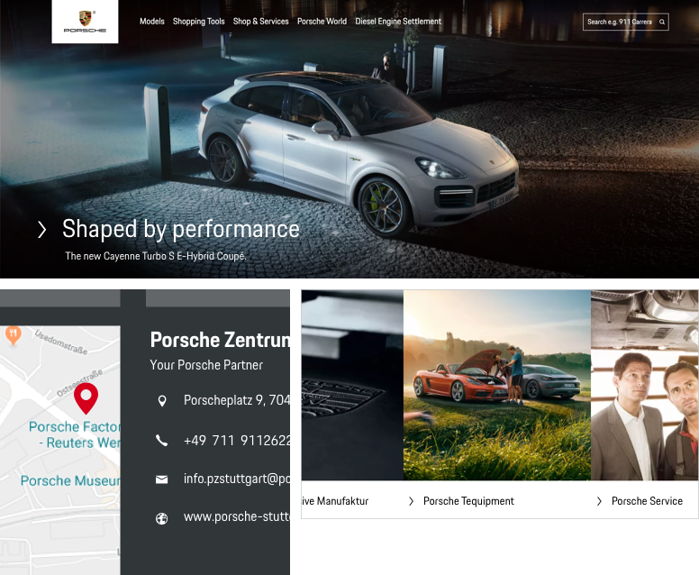

# Text Link

A text link is a clickable icon-text-combination used to navigate the user to another page or to trigger an event. Compared to buttons a text link is a rather subtle call-to-action with lower hierarchy.

---

## Available sizes

Per default, the text link component is set in **copytext size**. If a higher hierarchy level is needed, the text link can be set in any text size available in the typography's "additional sizes" set (either in thin or regular font-weight, always left-aligned). The size of the icon changes accordingly. Always make sure to use thin font-weight only for sizes 20 px or larger due to a better legibility.  

---

## States

| STATE | DESCRIPTION |
|----|----|----|
| **Default** | The icon is either black or white in default state, depending on the Porsche Theme in use. |
| **Active / Hover** | In active and hover state, both icon and text turn Porsche Red and underlined (in order to make these states visible also for users with red-green visual impairments). |
| **Disabled** | When the Text Link isn't clickable, this is indicated by a greyed-out disabled state. |
| **Loading** | To indicate the loading process when clicking on the text link, the icon is replaced by a small loading spinner. |
| **Focus** | In focus state, the text link is bordered by a 2 px line in focus color. |

---

## Content

The Text Link component includes the following sub-components:

- **Icon**
The icon within the Text Link component can be replaced by any icon available in the Porsche web icon set. Per default, an arrow right is set that should serve in most of all cases.  It should only be changed if it is ensured that another symbol is more appropriate to support the text content, making it easier for the user to understand the function quickly. A good example might be to use a shopping icon or a plus icon for a Text Link function "Add to cart".
- **Text label**
The text label within the Text Link component should be short and descriptive.

---

## Text links on images

Text links can be placed on images, e.g. when using it as an additional link on image sliders or teaser images that are clickable themselves. In this case, the text link can give the user an additional hint on the clickability of the whole image. 
Make sure to always use regular font-weight in text links that are placed on images to provide legibility.

## Additional subtext

A text link in 20 px or larger can be accompanied by an additional copytext with lower hierarchy. In this case, the copytext should be placed left-aligned with the link text in the text link component.

## Text link groups

Multiple text links can be combined to one text link group that must be stacked left-aligned in order to guarantee scanability and legibility. It is recommended to not group more than 6 text links in a row.

---

## Best Practices

(1) Text link place on image. (2) Text links in the form of different icon-text-combination. (3) Text link groups.