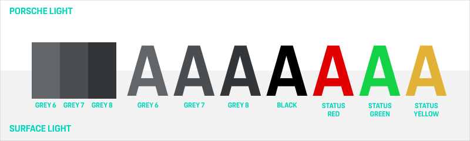
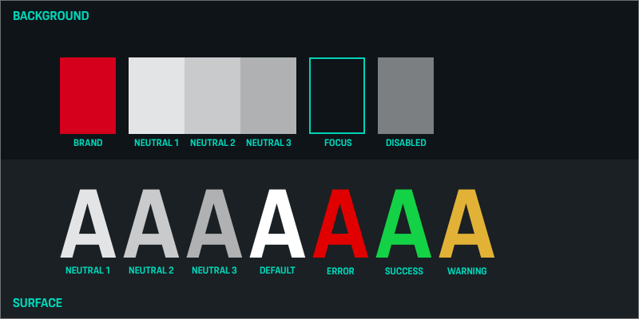
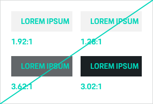
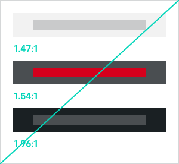

# Color

Together with other basic elements like typography, iconography or imagery, the
right use of colors gives every UI the specific Porsche feeling and is
therefore one of the most important tools to create a consistent visual
branding. Even more so when it comes to UX, color is to be used intentionally to create
patterns, set emphasis on important elements and, by doing so, provide visual
guidance and information.

The Porsche Design System color system provides two Porsche Design System color themes that are based on the Porsche color palette and can be
used for different visual environments. The Porsche Design System color palette includes both brand colors and neutral colors. 
They must always be used in 100% opacity. The Porsche Design System Sketch library provides both themes.

---

## Porsche Design System color themes

When designing Porsche applications, the first decision to make is whether the content should be displayed in a merely light or dark environment.
That's when the Porsche Design System color themes come into play: **The first choice should always be the Porsche Light Theme**. The Porsche Dark Theme is only to be
used for exceptional cases, e.g. if an application is to stand out from the rest of visual communication for strategic reasons or if the context of use 
is unsuitable for a bright shining display. All Porsche Design System components are optimized for the light and dark Theme.

### Theme colors
Each theme comes with a limited color set you should stick to for page backgrounds and text/icons. 
When it comes to additional elements, such as tiles, dividers or other graphical elements, you have two options:

- Use the accessibility-safe colors provided for the theme ("Additional elements" palette). This is highly recommended whenever you want to convey important information.
- Use any other color of the Porsche color palette. This only makes sense for displaying "nice to have" or "aesthetic only" elements that are not crucial for information perception.

In order to define the colors to be used within the screen you should always check the **information level** of the respective elements.

- Play with darker/lighter grey shades to make an element stand out from the background or to set emphasize on it. 
- For large screen space make sure to only use the dedicated surface color for your theme (e.g. Surface). 
- Use the brand color only for highlighting single elements.

### Mixing themes
Within certain limits it's allowed to mix the Porsche color themes. For example let's say you could integrate a limited Dark Theme area in your Light Theme
to visually distinguish the footer from the content. Always make sure that the vast majority of the screen consists of the initially chosen theme.
The color proportion scales for each theme might be a little helper in doing so.

---

## Porsche Light Theme 

### Brand color
The Porsche brand color are the core of the Porsche Design System color palette. The usage
and proportion of brand colors within a UI is defined by the specific Porsche
color theme in use.

|                                                                              	|                      	    | HEX     	| RGB           	| Usage                                     |
|-----------------------------------------------------------------------------	|---------------------------|----------	|----------------	|------------------------------------------ |
| <ColorBadge theme="light" color="brand"/> 	                                          | **Brand**         	| #D5001C 	| 213/0/28       	| Hover or active state                     |

### Background colors
The surface colors are the only colors to be used as filling for larger areas on the page backgrounds "Porsche Light" or "Porsche Dark".

|                                                                         	|                      	    | HEX     	| RGB           	| Usage            |
|-------------------------------------------------------------------------	|---------------------------|----------	|----------------	|----------------- |
| <ColorBadge theme="light" color="background"/>  	                                    | **Background**        	| #FFFFFF 	| 255/255/255   	| Page background  |
| <ColorBadge theme="light" color="surface"/> 	                                    | **Surface**        	| #F2F2F2 	| 242/242/242     | Additional backgrounds, for example for tiles or contrasting content areas |

### Text / icon color

|                                                                              	|                      	    | HEX     	| RGB           	| Usage                                     |
|-----------------------------------------------------------------------------	|---------------------------|----------	|----------------	|------------------------------------------ |
| <ColorBadge theme="light" color="default"/>    	                                      | **Default**        	| #000000 	| 0/0/0          	| Default text/icon color                   |

### Neutral colors
The neutral palette is to be used for all basic architectonic page elements – going from tile background colors to text or icon colors.
The set consists grey shades that are based on a pre-defined mixing ratio of black in combination with a slightly touch of blue.

|                                                                         	|                       	| HEX     	| RGB           	| Usage            |
|--------------------------------------------------------------------------	|-------------------------|----------	|----------------	|----------------- |
| <ColorBadge theme="light" color="neutral-1"/> 	                                    | **Neutral 1**             	| #626669 	| 98/102/105    	| div. elements    |
| <ColorBadge theme="light" color="neutral-2"/>                                      | **Neutral 2**             	| #4A4E51 	| 74/78/81      	| div. elements    |
| <ColorBadge theme="light" color="neutral-3"/>                                      | **Neutral 3**             	| #323639 	| 50/54/57       	| div. elements    |

### Notifications
Notification colors are to be used only to display warnings, error or status messages.
When using notification colors …

- … always make sure not to rely on color only when displaying status (for more information scroll down to *Accessibility*).
- … always check manually if the color contrast is sufficient depending on the Porsche color theme and, therefore, the background color in use.

|                                                                         	|                         	| HEX     	| RGB         	|
|-------------------------------------------------------------------------	|---------------------------|---------	|-------------	|
| <ColorBadge theme="light" color="notification-error"/> 	                          | **Error**          	| #E00000 	| 224/0/0   	  |
| <ColorBadge theme="light" color="notification-success"/> 	                        | **Success**        	| #13D246 	| 19/210/70  	  |
| <ColorBadge theme="light" color="notification-warning"/> 	                        | **Warning**        	| #E2B236 	| 226/178/54  	|

### States
The focus color is only to be used to highlight components on focus enabling users navigating through the website via keyboard.
Depending on the component it can be implemented in different ways, for example as border or surface color.

|                                                                         	|                         	| HEX     	| RGB         	|
|-------------------------------------------------------------------------	|---------------------------|---------	|-------------	|
| <ColorBadge theme="light" color="state-disabled"/>                            | **Disabled**            	| #7C7F81 	| 150/152/154     | Disabled state or decorative text/icons |
| <ColorBadge theme="light" color="state-focus"/>                          	  | **Focus**           	| #00D5B9 	| 0/213/185  	  |

### Color proportions

---

### Porsche Dark Theme

### Brand color
The Porsche brand color are the core of the Porsche Design System color palette. The usage
and proportion of brand colors within a UI is defined by the specific Porsche
color theme in use.

|                                                                              	|                      	    | HEX     	| RGB           	| Usage                                     |
|-----------------------------------------------------------------------------	|---------------------------|----------	|----------------	|------------------------------------------ |
| <ColorBadge theme="dark" color="brand"/> 	                                          | **Brand**         	| #D5001C 	| 213/0/28       	| Hover or active state                     |

### Background colors
The surface colors are the only colors to be used as filling for larger areas on the page backgrounds "Porsche Light" or "Porsche Dark".

|                                                                       	|                      	    | HEX     	| RGB           	| Usage            |
|-----------------------------------------------------------------------	|---------------------------|----------	|----------------	|----------------- |
| <ColorBadge theme="dark" color="background"/> 	                                    | **Background**        	| #0E1418 	| 14/20/24      	| Page background  |
| <ColorBadge theme="dark" color="surface"/>                                      | **Surface**        	| #1A2023 	| 26/32/35        | Additional backgrounds, for example for tiles or contrasting content areas |

### Text / icon color

|                                                                         	|                    	    | HEX     	| RGB           	| Usage                                   |
|-------------------------------------------------------------------------	|-------------------------|----------	|----------------	|---------------------------------------- |
| <ColorBadge theme="dark" color="default"/>  	                                    | **Default**      	| #FFFFFF 	| 255/255/255    	| Default text/icon color                 |

### Neutral colors
The neutral palette is to be used for all basic architectonic page elements – going from tile background colors to text or icon colors.
The set consists grey shades that are based on a pre-defined mixing ratio of black in combination with a slightly touch of blue.

|                                                                         	|                       	| HEX     	| RGB              	| Usage            |
|-------------------------------------------------------------------------	|-------------------------|----------	|-----------------	|----------------- |
| <ColorBadge theme="dark" color="neutral-1"/> 	                                    | **Neutral 1**             	| #B0B1B2 	| 176/177/178      	| div. elements    |
| <ColorBadge theme="dark" color="neutral-2"/> 	                                    | **Neutral 2**             	| #C9CACB 	| 201/202/203      	| div. elements    |
| <ColorBadge theme="dark" color="neutral-3"/> 	                                    | **Neutral 3**             	| #E3E4E5 	| 227/228/229     	| div. elements    |

### Notifications
Notification colors are to be used only to display warnings, error or status messages.
When using notification colors …

- … always make sure not to rely on color only when displaying status (for more information scroll down to *Accessibility*).
- … always check manually if the color contrast is sufficient depending on the Porsche color theme and, therefore, the background color in use.

|                                                                         	|                         	| HEX     	| RGB         	|
|-------------------------------------------------------------------------	|---------------------------|---------	|-------------	|
| <ColorBadge theme="dark" color="notification-error"/> 	                                        | **Error**          	| #E00000 	| 224/0/0   	  |
| <ColorBadge theme="dark" color="notification-success"/> 	                                      | **Success**        	| #13D246 	| 19/210/70  	  |
| <ColorBadge theme="dark" color="notification-warning"/> 	                                    | **Warning**        	| #E2B236 	| 226/178/54  	|

### States
The focus color is only to be used to highlight components on focus enabling users navigating through the website via keyboard.
Depending on the component it can be implemented in different ways, for example as border or surface color.

|                                                                         	|                         	| HEX     	| RGB         	|
|-------------------------------------------------------------------------	|---------------------------|---------	|-------------	|
| <ColorBadge theme="dark" color="state-disabled"/>                                      | **Disabled**            	| #7C7F81 	| 150/152/154     | Disabled state or decorative text/icons |
| <ColorBadge theme="dark" color="state-focus"/>                             	          | **Focus**           	| #00D5B9 	| 0/213/185  	  |

### Color proportions

--- 

## Porsche color principles

### Be consistent.
Once you’ve picked a **Porsche color theme** for you UI design you should stick with it within the application.
Ensure consistency by integrating audits in your workflow.

### Be accessible.
Always keep in mind that **not every user gets to experience colors the same way**
due to color blindness, visual impairment or simply because of the environment.
Therefore, you should always care about accessibility.

### Be purposeful.
Use color wisely and always **focus on supporting the user’s needs** and the purpose of the content within the UI.

### Be Porsche.
Generate a dedicated **Porsche feeling** within the UI by using the colors given
in the brand color palette. Avoid using shades or opacity values for the brand
colors.

Sticking to the [Porsche Brand Code](https://brandguide.porsche.com/elements/manual/view/id/548) this means:

- Generous (but also well-considered) use of white space to emphasize the brand’s exclusiveness and high-quality.
- Form follows function – and so does color.
- Use color to support a clean, precise design language. Stick to the essentials and avoid a non-functional decorative use of color.

---

## Accessibility

In order to make content accessible for a wide range of people and to improve the product’s usability in general, we stick to the common [WCAG 2.1 Standard](#/web/basics/accessibility-criteria) when designing Porsche web applications.

- Always ensure a sufficient contrast ratio. The combination of text and background color should pass the WCAG AA standard and have a contrast ratio of at least 4.5:1 for standard text size and 3:1 for larger text sizes.

- Combinations of other colored elements must pass the WCAG AA standard with a minimum 3:1 ratio, unless it's only a decorative element.

- Don’t rely on color only to convey information (for example when displaying status or error messages). This is of high importance especially in critical cases, e.g. when displaying safety-relevant vehicle data.

---

## Helpful tools and resources

### Sketch palette
Feel free to download the [Porsche color palette for Sketch](https://ui.porsche.com/latest/porsche-ui-kit-colors.sketchpalette) in order to use it as "Document Colors" or "Global Colors" in your color picker.
The easiest way to import the palette to Sketch is by using the plugin [Sketch Palettes](https://github.com/andrewfiorillo/sketch-palettes).

### Sketch plugins
- [Stark](https://getstark.co)
- [Color Contrast Analyser](https://github.com/getflourish/Sketch-Color-Contrast-Analyser)
Both plugins help you to check the color contrast of two selected layers in Sketch, no matter if it's text or surface color.

### Web tools
- [Color Oracle](https://colororacle.org/) is a free color blindness simulator for both Windows and Mac, that gives you an impression on how your designs are perceived by visually impaired users.
-  With [Tanaguru Contrast Finder](http://contrast-finder.tanaguru.com/) you can easily check color contrasts on your desired level of accessibility.

---

## Don'ts

