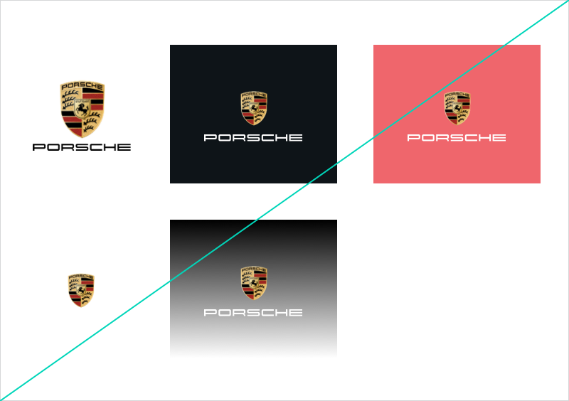

# Marque

The Marque gives the Porsche brand a distinctive profile, sets it apart from others within the overall external image and represents the quality of the product. 

---

## Variants

### With registered trademark (®)

<p-marque></p-marque>

In web applications for the United States and/or Canada as well as with international purpose *including* United States and/or Canada, the Porsche Marque must always be used with the ®. The ® is optimized to match the respective Crest size.

### Without registered trademark

<p-marque trademark="false"></p-marque>

This variant is to be used whenever the United States and/or Canada are not part of the web application's target markets.

---

## Sizes

| Size | Usage |
|------|--------|
| **Small** | Viewports with 999 px width or lower |
| **Large** | Viewports with 1000 pixel width or larger |

Slight adjustments ensure that the Porsche marque is optimally perceived as equally as possible in the various image sizes.

---

## Content

The two elements that make up the overall logo for the Porsche marque are the **word "Porsche" (logotype)** and the **Porsche Crest** as an image-based logo. The three-dimensional colored Porsche marque is used as a fixed unit, always including crest and logotype, across all media, and **may not be changed**. 

---

## Usage

- Within static digital applications, the Porsche Marque is **always used without shadow**. For moving images a separate Crest with shadow is available.
- The Porsche Marque may **only be used on a white background**.

--- 

## Don'ts

- The Marque **may not be altered** in relation to its two elements or their size. The Marque may never be used without the Porsche lettering, as the sender identification cannot be guaranteed.
- The Porsche Marque **may not be used against coloured or busy backgrounds** (e.g. shading). As the Porsche Crest has a high level of graphical complexity, excessive visual turmoil may be created.

