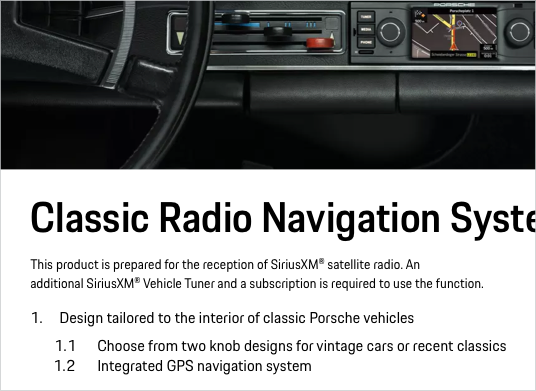

# Text List

A Text List groups and organizes related content vertically in two hierarchical levels (level 1 and level 2 with indent). Generally lists are supposed to be used for short pieces of information and should not exceed two hierarchy levels. For more complex data sets the use of a data table should be considered.

---

## Variants

### Unordered list

An unordered list is used to show content with equal value.

### Ordered List** 

---

## Usage

### Order
It is recommended to arrange list items in a logical way, from  highest to lowest level, and to split the content up into smaller and more specific grouped categories. 

### Writing style
Try to stick to a homogeneous writing structure and style within one list. Avoid e.g. mixing active with passive voice or declarative with imperative sentences. 

### Capitalization
Use sentence-style capitalization for each list item: capitalize only the first letter of the item.