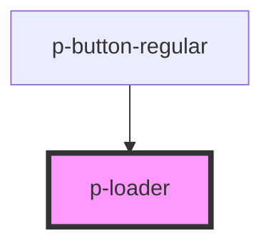

# p-loader

<!-- Auto Generated Below -->

## Properties

| Property | Attribute | Description                                           | Type                                          | Default   |
| -------- | --------- | ----------------------------------------------------- | --------------------------------------------- | --------- |
| `size`   | `size`    | Predefined loader sizes.                              | `"large" \| "medium" \| "small" \| "x-small"` | `"small"` |
| `theme`  | `theme`   | Adapts the loader color when used on dark background. | `"dark" \| "light"`                           | `"light"` |

## Dependencies

### Used by

 - [p-button-regular](../../action/button-regular)

### Graph

----------------------------------------------

*Built with [StencilJS](https://stenciljs.com/)*
