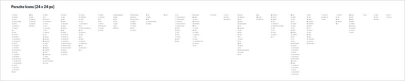

# Icon

Along with the other Porsche basic elements - such as colors, typography and the Porsche Marque - icons are core components of the Porsche UI design. The clear graphic symbols allow for quick orientation and are internationally recognized.

## Icon overview

---

## Look & feel

The clean style of the Porsche icon set matches the Porsche brand aesthetically and creates a consistent look and feel across all products and platforms. Each icon is reduced to its minimal form reflecting essential characteristics. By following the typical Porsche lines and uniting the exclusive, high-classy and very sportive brand image, the Porsche icons provide  a high recognizability and readability, even in very small sizes. 

---

## Base area & grid

All icons are placed on a transparent 24x24 pixel base area, including a dedicated safe zone. 

The icons themselves are built upon a base grid structure and guidelines for sizing the different icon shapes. These scale guidelines ensure that each icon has the same visual weight so they all feel the same size, regardless of their overall shape. 

---

## States

The icon component is by default only supposed to be displayed in monochrome colors (Dark Theme: White, Light Theme: Black).

For interactive icons you should use the [Button Icon](#/web/action/button-icon) that comes with a dedicated click/touch area and with different states (disabled etc.).

---

## Best Practices

### Color usage

The icons come with standard colors within the Porsche UI Kit you should stick to. However, when deciding to override the default icon colors for special reasons, it is recommended to use the color(s) uniformly throughout your application in order to provide consistency.

### Context

Icons can stand alone for themselves as visual symbols or in combination with text. Either way, always keep in mind that a semantic element can have different meanings depending on the context it is put into, such as within different labels.