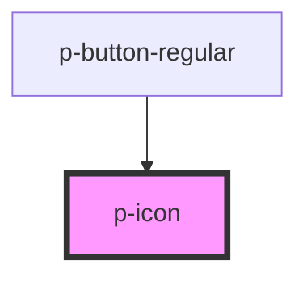

# ion-icon

<!-- Auto Generated Below -->

## Properties

| Property    | Attribute    | Description                                                                                     | Type                             | Default                                    |
| ----------- | ------------ | ----------------------------------------------------------------------------------------------- | -------------------------------- | ------------------------------------------ |
| `ariaLabel` | `aria-label` | Specifies the label to use for accessibility. Defaults to the icon name.                        | `string`                         | `undefined`                                |
| `color`     | `color`      | The color to use for the background of the item.                                                | `string`                         | `undefined`                                |
| `flipRtl`   | `flip-rtl`   | Specifies whether the icon should horizontally flip when `dir` is `"rtl"`.                      | `boolean`                        | `undefined`                                |
| `icon`      | `icon`       | Specifies which icon file to use.                                                               | `string`                         | `undefined`                                |
| `ios`       | `ios`        | Specifies which icon to use on `ios` mode.                                                      | `string`                         | `undefined`                                |
| `lazy`      | `lazy`       | If enabled, ion-icon will be loaded lazily when it's visible in the viewport. Default, `false`. | `boolean`                        | `false`                                    |
| `md`        | `md`         | Specifies which icon to use on `md` mode.                                                       | `string`                         | `undefined`                                |
| `mode`      | `mode`       | The mode determines which platform styles to use. Possible values are: `"ios"` or `"md"`.       | `"ios" \| "md"`                  | `undefined`                                |
| `path`      | `path`       | Specifies the exact http(s) `path` to an SVG file to use.                                       | `string`                         | `"https://ui.porsche.com/cdn/0.0.3/icon/"` |
| `size`      | `size`       | The size of the icon.                                                                           | `"large" \| "medium" \| "small"` | `undefined`                                |

## Dependencies

### Used by

 - [p-button-regular](../../action/button-regular)

### Graph

----------------------------------------------

*Built with [StencilJS](https://stenciljs.com/)*
