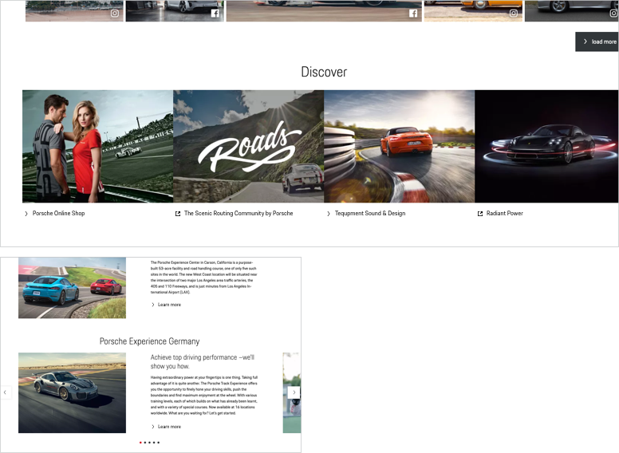

# Link Pure

A link pure is a clickable icon-text-combination used to navigate the user to another page.

---

## Available sizes

Per default, the link pure component is set in **copytext size**. If a higher hierarchy level is needed, the link pure can be set in 3 other sizes are used available in the typography's "additional sizes" set (always left-aligned). The size of the icon changes accordingly. 

---

## States

| STATE | DESCRIPTION |
|----|----|----|
| **Default** | The icon is either black or white in default state, depending on the Porsche Theme in use. |
| **Active / Hover** | In active and hove r state, both icon and text turn Porsche Red and underlined (in order to make these states visible also for users with red-green visual impairments). |
| **Focus** | In focus state, the link pure is bordered by a 2 px line in focus color and with a distance of 1 px to the component. |

---

## Content

The Link Pure component includes the following sub-components:

### Icon 
The icon can be replaced by any icon available in the Porsche web icon set. By default, an arrow right is set that should serve in most of all cases. It should be changed only if it is ensured that another symbol is more appropriate to support the text content, making it easier for the user to understand the function quickly. For internal links the arrow should be sufficient in the most cases. External links can be displayed with the following icon: <p-icon name="link-extern" size="x-small" aria-label="Extern link"></p-icon>.

### Text label
The text label within the Link Pure component should be short and descriptive.

---

## Links Pure on images

Links Pure can be placed on images, e.g. when using it as an additional link on image sliders or teaser images that are clickable themselves. In this case, the link pure can give the user an additional hint on the clickability of the whole image. Make sure to always use regular font-weight in links pure that are placed on images to provide legibility.

## Additional subtext

A link pure in 20 px or larger can be accompanied by an additional copytext with lower hierarchy. In this case, the copytext should be placed left-aligned with the link text in the link pure component.

    <p-headline variant="headline-3" tag="h3" style="margin-bottom: 24px;">Examples</p-headline>
    

