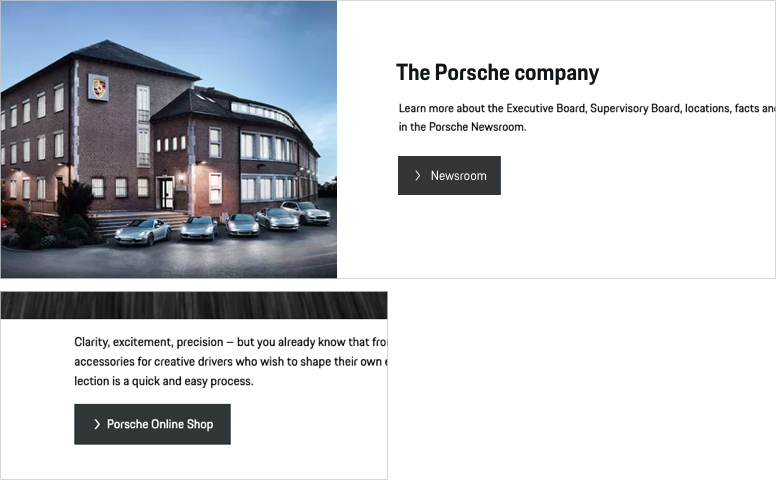

# Link

A Link enables the user to jump to another page with a single tap. For an optimal user guidance and dedicated pursuit of business or sales goals, different types of links (primary, secondary, tertiary) can be used.

---

## Available variants

The Link is provided in 2 different variants:

- **Icon and Text** Default link size with 48 px height. The link length adapts to the length of the text label.
- **Icon only** The icon only contains an icon and no further text information, it is highly recommended to use it only in cases where the user is fully aware of the link function (this can be ensured e.g. by using an expressive icon or by logical composition with other components).

## Link types

### **1. P**rimary

<p-link variant="primary" href="https://www.porsche.com">Some label</p-link>

Link with color fill in Porsche Red. This type is only to be used for one or two high-priority actions, in order to give the user the best guidance possible.

### **2. S**econdary

<p-link href="https://www.porsche.com">Some label</p-link>

Default link with monochrome color fill. To be used for all other stand-alone links that aren't high priority.

### **3. T**ertiary

<p-link variant="tertiary" href="https://www.porsche.com">Some label</p-link>

An "outline only" link version. In hierarchy the tertiary link is always subordinated to the filled view. Thus, it can be used in two different cases:

- In combination with a filled link (Primary or Secondary), for example in popular pairings such as "submit" (filled) and "cancel" (Tertiary).
- Stand-alone, when the priority of the action is lower compared to all other link actions within this page.

---

## Link states

All link types are available in the following states:

| STATE | DESCRIPTION |
|----|----|----|
| default | Default link state. |
| active / hover | In active or hover state, the background color changes slightly and gets either a bit lighter or darker. |
| focus | In focus state, the link is framed by a 2 px line in focus color. |

---

## Content

The Link is available for both Porsche Light and Dark Theme. It always contains the following sub-components:

- **Icon** The icon can be replaced by any icon available in the Porsche web icon set. By default, an arrow right is set that should serve in most of all cases. It should be changed only if it is ensured that another symbol is more appropriate to support the text content, making it easier for the user to understand the function quickly. For internal links the arrow should be sufficient in the most cases. External links can be displayed with the following icon: <p-icon name="link-extern" aria-label="Link extern"></p-icon>.
- **Text label** The text label is always set in copytext size. The length of the text label determines the size of the link. Multiline text is possible, while the content (both text and icon) are always positioned top left aligned within the link. It is recommended to keep the text label short and descriptive.

---

## Link position

By default the Link is to be positioned left-aligned within a module or a screen. Depending on content and user guidance, the position can be changed individually, e.g. placed right-aligned or at the end of a text (e.g. error notifications)

---

## Usability & interaction

### Clickability

The whole link area is clickable. The clickability is indicated by a specific hover state (slightly changing color).

### Link width

Even if there is no technical limit to the link width, you should always make sure that the link remains legible, even more so in multiline state. It is recommended to use max. 100 characters per line (equals approx. 700 px link width).

    <p-headline variant="headline-3" tag="h3" style="margin-bottom: 24px;">Examples</p-headline>
    

