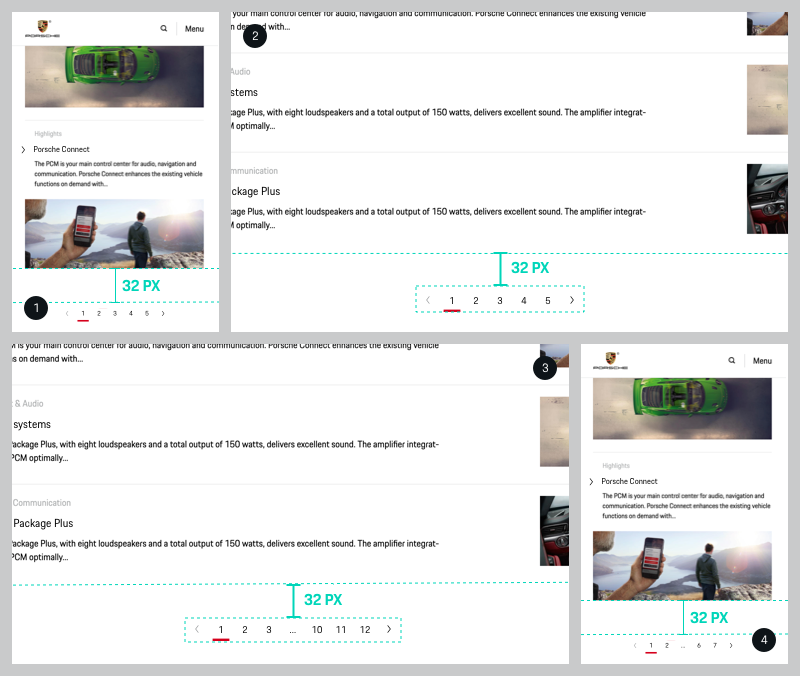

# Pagination

The Pagination is used whenever a content (text, images, videos) is split into several pages. It provides information on the existing amount of pages, shows the current page position and allows the user to navigate between the single content pages. The pagination is the component of choice primarily for listed content (e.g. search results, archives etc.), where the user wants to find a specific item.

---

## Available sizes

The Pagination comes in 4 different sizes:

| ITEMS   | PURPOSE |
|----|----|----|
| **1 item** | 1-page content, recommended only for temporarily views such as search results. |
| **2 items** | 2-page content. |
| **5 items** | For content with 5 pages or more. |
| **7 items** | Maximum Pagination size for content with 7 pages or more. Recommended to be used for device widths equal or larger than 480 px. |

---

## Content

The Pagination component includes the following sub-components:

- **Arrow left & right**
An arrow is placed on the left and right of the page numbers, enabling to click
- **Page numbers**
The page numbers are set in copysize and turn Porsche Red on hover.
- **Ellipsis (optional)**
The ellipsis ("...") represents multiple pages that can't be displayed to limited Pagination component width.

---

## Positioning and spacing

The Pagination should always be placed centered beneath the related content, keeping a minimum top spacing of 32 px.

---

## Usability & interaction

### Clickability

Each pagination item (arrows, numbers, ellipsis) spans over a clickable area of 40 x 40 px to guarantee a proper click- and touch-ability (on mobile devices).

### Disabled arrows

Whenever the user reaches the first or last page, the respective arrow will be disabled.

### Skipping pages

The arrows allow to skip to the previous or next page and therefore interactive by default. When reaching the first or last content page, neither the left nor right arrow are disabled.

### Current page

The current page position is always marked by a red underline. By default, the current page item is not clickable.

### Displaying 8 pages or more

If there are at least 8 pages, an ellipsis ("...") is shown for a dedicated range of pages that are located inbetween the visible pagination numbers. The ellipsis is not clickable.

If there are at least 8 pages, an non-clickable ellipsis ("...") is displayed for the allocated range of pages located inbetween the visible page items.

---

## Best Practices
