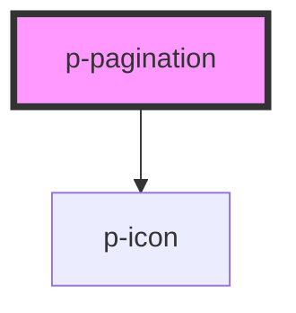

# p-pagination

<!-- Auto Generated Below -->

## Properties

| Property          | Attribute           | Description                                                     | Type                | Default     |
| ----------------- | ------------------- | --------------------------------------------------------------- | ------------------- | ----------- |
| `activePage`      | `active-page`       | Index of the currently active page.                             | `number`            | `1`         |
| `itemsPerPage`    | `items-per-page`    | The total count of items per page.                              | `number`            | `undefined` |
| `pageRange`       | `page-range`        | The number of pages between ellipsis. 0 = mobile \| 1 = desktop | `0 \| 1`            | `1`         |
| `theme`           | `theme`             | Adapts the color when used on dark background.                  | `"dark" \| "light"` | `"light"`   |
| `totalItemsCount` | `total-items-count` | The total count of items.                                       | `number`            | `undefined` |

## Events

| Event    | Description                       | Type                |
| -------- | --------------------------------- | ------------------- |
| `pClick` | Emitted when the link is clicked. | `CustomEvent<void>` |

## Dependencies

### Depends on

- [p-icon](../../icon/icon)

### Graph

----------------------------------------------

*Built with [StencilJS](https://stenciljs.com/)*
